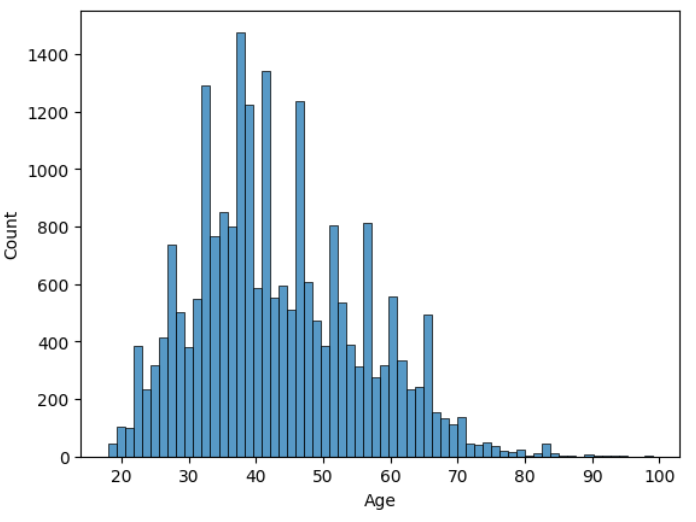
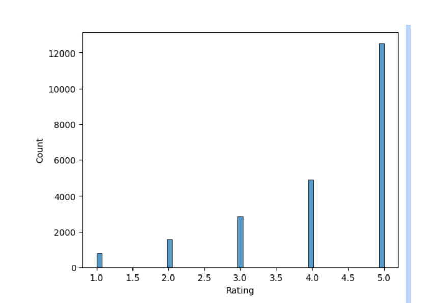
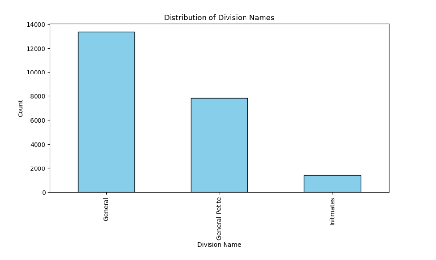
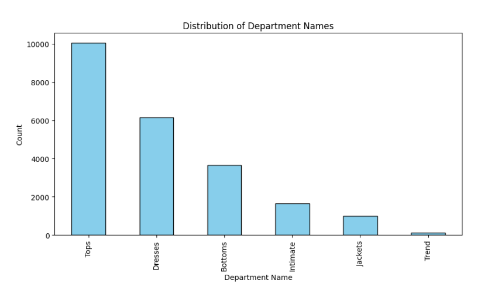
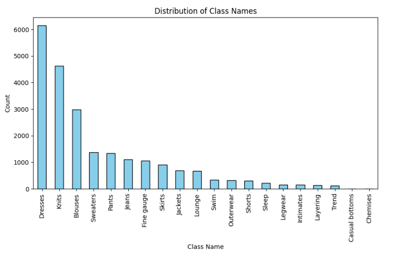
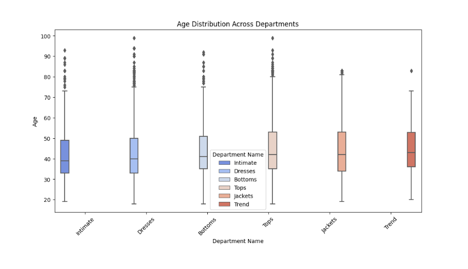
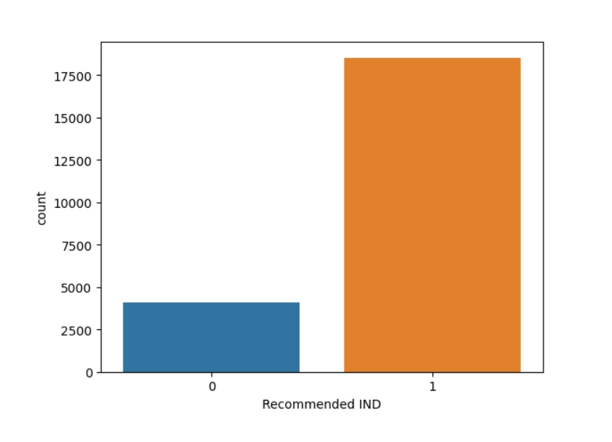
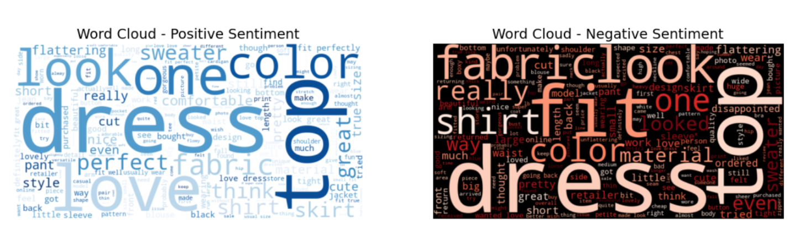
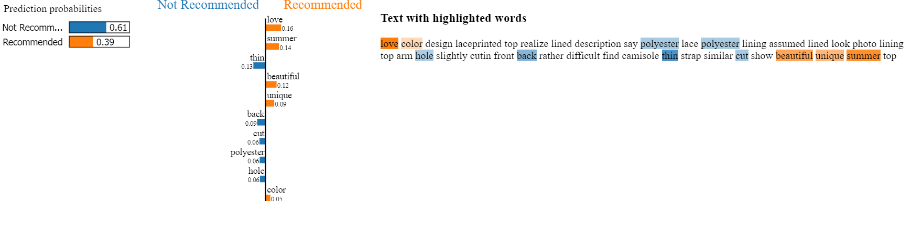

# NLP ANALYSIS: WOMEN'S CLOTHING E-COMMERCE REVIEWS
# PROJECT BY: GROUP 5 MEMBERS
1. Ian Bett
2. Linet Patriciah
3. Lionel Ajeliti
4. Morgan Abukuse Amunga
5. Sanayet Nelly Sankaine
   
# DATE: 02/04/2025
# DS: FULLTIME REMOTE

# Overview
In the fast-growing e-commerce industry, customer reviews play a crucial role in shaping brand perception, influencing purchases and identifying areas for improvement. This project focuses on analyzing women’s clothing reviews to extract meaningful insights using Natural Language Processing (NLP) and data science techniques.

By leveraging sentiment analysis, text preprocessing, and machine learning, we aim to classify customer sentiment, understand the key drivers of customer satisfaction or dissatisfaction (e.g., product fit, fabric quality, sizing) and provide recommendations for product improvements and marketing strategies, tailored to customer feedback.

# Methodology
The project follows a structured **data science workflow** incorporating several key methodologies:
1. **Data Understanding and EDA:**  
   We explore the dataset to understand its structure, check for missing values or duplicates, and examine key variables. Statistical summaries and visualizations such as histograms, bar charts, and word clouds help uncover patterns and trends in customer sentiment.

2. **Data Preprocessing and Text Cleaning:**  
   The raw review text is preprocessed using NLP techniques such as lowercasing, noise removal (URLs, punctuation, special characters), tokenization, stopword removal, lemmatization, and n-gram generation. This step ensures the text is in a clean, consistent format for feature extraction.

3. **Feature Engineering:**  
   We use **TF-IDF (Term Frequency-Inverse Document Frequency)** to transform the preprocessed text into numerical features. Both unigrams (single words) and bigrams (two consecutive words) are included to capture relevant patterns in the text. Dimensionality reduction (e.g., TruncatedSVD) is optionally applied to reduce feature space and enhance model efficiency.

4. **Model Selection and Training:**  
   We start with a **baseline Logistic Regression model** to provide a performance benchmark. Advanced models, including **Multinomial Naive Bayes** and **Support Vector Machines (SVM)** are explored to improve classification accuracy.

5. **Model Evaluation:**  
   The model's performance is evaluated using **accuracy**, **precision**, **recall**, **F1-score**, and **ROC-AUC** (for binary classification). A confusion matrix is used to visually assess misclassifications. Hyperparameter tuning with **GridSearchCV** and **cross-validation** is implemented to optimize the model and ensure generalizability.

6. **Interpretability and Explainability:**  
   We use tools like **LIME** (Local Interpretable Model-agnostic Explanations) to understand individual predictions and feature importance, ensuring transparency and trust in the model's decision-making.

# Business Understanding
The primary objective of this analysis is to leverage Natural Language Processing (NLP) techniques to perform sentiment analysis on women’s e-commerce clothing reviews. This will help businesses extract valuable insights from customer feedback and enhance decision-making.

**Objectives:**  
- Sentiment Classification: Build a model to classify customer reviews as Positive or Negative, using review text as the main feature. The goal is to achieve at least 80% accuracy and an F1 score of 0.80.
- Topic Modeling: Identify key themes in customer reviews (e.g., product quality, sizing, shipping experience) using techniques like Latent Dirichlet Allocation (LDA).
- Actionable Insights: Use visualizations (e.g., word clouds, sentiment trends) to provide recommendations for product improvements and customer engagement strategies.

**Target Audience**
This analysis is valuable for:
- E-commerce Businesses – To understand customer sentiment and improve offerings.
- Product Managers & Merchandisers – To make data-backed product decisions.
- Marketing Teams – To craft targeted campaigns based on customer preferences.
- Data Scientists & Analysts – To explore NLP techniques in a real-world business context.

**Success Metrics**
- Achieve at least 80% accuracy and an F1-score of 0.80 on the test set.
- Identify key factors like product quality, fit, pricing and customer service.
- Provide clear, actionable recommendations based on sentiment trends and topic distributions.

# Data Understanding
The dataset used in this analysis consists of customer reviews for women’s clothing, sourced from [Kaggle](https://www.kaggle.com/datasets/nicapotato/womens-ecommerce-clothing-reviews). This dataset contains 23,486 rows and 10 features. It contains text-based feedback along with numerical ratings and other metadata.

  **Key Features**
  - **Clothing ID:** Categorical variable referring to the specific product reviewed.
  - **Title:** Title of the review.
  - **Review Text:** The primary textual feedback provided by customers.
  - **Rating:** A numerical score (1-5) reflecting the product score granted by the customer.
  - **Recommended IND:** A binary indicator of whether a customer recommends the product (1 = Recommended, 0 = Not Recommended).
  - **Positive Feedback Count:** The number of customers who found a review helpful.
  - **Age**: The age of the reviewer.
  - **Division Name, Department Name, Class Name:** Product categorization details.
    
  **Target Variable**
    - **Recommended IND**

# Data Preparation
Before analysis, the dataset was prepared by handling missing values, duplicates, and necessary transformations:
- Handling Missing Data: 'Reviews',' Division Name', 'Department Name', and 'Class Name' with missing text were removed, as they provide no value for sentiment analysis.
- Dropping irrelevant columns: 'Clothing ID', 'Title', 'Unnamed: 0' were dropped as they are not essential for analysis. 
- Removing Duplicates: Duplicate reviews were identified and dropped to ensure unbiased analysis.
- Sentiment Labeling: A new Sentiment column was created based on the Recommended ID: Positive: 1, Negative: 0

# Exploratory Data Analysis (EDA)

  
EDA uncovers patterns and insights in our data. In this section, we will:
- **Visualize Distributions:** Create charts of different features. 
- **Generate a Word Cloud:** Visually display the most frequent words in the text.

These visualizations help guide further data processing and model decisions.

### Distribution of Age

The histogram shows the frequency of reviewers across different age groups.
**Peak Age Range**: The most frequent reviewers seem to be in their 30s to 50s, with peaks around 40 years old.
**Right-Skewed Distribution**: The distribution is slightly right-skewed, meaning there are fewer older reviewers.
**Outliers**: There are a few reviewers in the 80+ range, but they are sparse.

### Distribution of Rating

The rating distribution for women's clothing in the dataset shows a strong positive bias toward higher ratings.
The majority of the reviews have a rating of 5, making it the most common score.
The second-highest frequency is for ratings of 4, indicating that most customers were satisfied with their purchases.
Ratings of 3, 2, and 1 are significantly lower in comparison, suggesting fewer neutral or negative reviews.

### Distribution of Division Names

### Distribution of Department Names

### Distribution of Class Names

### Age Distribution Across Departments

### Distribution of The Target Variable

### Word cloud of Positive and Negative Sentiments

# Data Preprocessing and Cleaning(Text Specific)
To prepare the text for sentiment analysis, several preprocessing techniques were applied to ensure the text data was structured and optimized for feature extraction and model training:
- Lowercasing: Standardized all text to lowercase for consistency.
- Text Cleaning: Removed URLs, HTML tags, special characters, extra spaces, and numbers to retain only meaningful words.
- Tokenization: Split text into individual words (tokens) for further processing.
- Stopword Removal: Eliminated common words (e.g., “the”, “and”) that do not contribute to sentiment.
- Lemmatization: Reduced words to their base forms (e.g., “running” → “run”) to maintain word consistency.
- N-gram Generation: Created bigrams to capture context and relationships between words.

# Feature Engineering and Representation
To prepare the text data for machine learning models, we transformed the cleaned review text into numerical features using Text Vectorization and Dimensionality Reduction techniques.

1. Text Vectorization
- Used TF-IDF (Term Frequency-Inverse Document Frequency) to convert text into numerical values.
- Incorporated unigrams (single words) and bigrams (word pairs) to capture word meaning and context.
- Resulting feature matrix: (22625, 5000) features.

2. Dimensionality Reduction
- To optimize computational efficiency and reduce overfitting, we applied dimensionality reduction:
- TruncatedSVD: Similar to PCA, but optimized for sparse data.
- Non-Negative Matrix Factorization (NMF): Ensures all values remain positive, making it suitable for models like Multinomial Naïve Bayes.
- Reduced feature matrix from (22625, 5000) → (22625, 100) while preserving essential information.

# Model Selection and Training
The Logistic Regression model was chosen as the baseline due to its simplicity, efficiency, and effectiveness in text classification tasks. It provided a strong initial benchmark for comparing more complex models. To handle class imbalance, we applied SMOTE, which balanced the distribution of the target variable.

Several other models were explored:
- GridSearchCV: Selected for hyperparameter tuning to optimize parameters.
- Support Vector Machine (SVM) using LinearSVC: Often effective for high-dimensional, sparse data. These alternative approaches allow us to compare their performance with our baseline.
- Multinomial Naive Bayes: A popular model for text classification
  

# Model Evaluation 
After training, the baseline Logistic Regression achieved an accuracy of 83.6%, with strong precision for the "Recommended" class (95%) but moderate performance for the "Not Recommended" class. 

Hyperparameter tuning with GridSearchCV further improved the Logistic Regression model, achieving the best cross-validation F1-score of 0.90, which made us choose this model as the final choice. 

Other models, including Multinomial Naive Bayes and LinearSVC, were explored to compare performance. These models showed varying results, with Multinomial  Naive Bayes reaching 76.1% accuracy and LinearSVC performing similarly to Logistic Regression at 83.5%.

Each model's performance was evaluated based on accuracy, precision, recall, F1-score, and confusion matrix insights.

# Model Interpretability & Feature Importance
In this section, we:
- Examine model coefficients to identify the top positive and negative features (words or n-grams) for each rating class.
- Use interpretability tools like LIME to provide local explanations for individual predictions.
- Prepare visualizations and explanations that are accessible to non-technical stakeholders.
  
Key Takeaways:
- LIME provides interpretability by identifying words that influenced the prediction.
- Negative words (fabric issues, fit problems) led to a "Not Recommended" classification.
- Positive words (love, beautiful, unique) were present but not strong enough to shift the prediction.
 

# Conclusion

1. **Objective Achievement:**  
   We built a predictive model using over 22,000 cleaned reviews.  
      The model classifies reviews based on ratings, aligning with our goal of understanding customer sentiment and product quality.

2. **Data Processing and Feature Engineering:**  
   We performed comprehensive cleaning and preprocessing, including lowercasing, noise removal, tokenization, stopword removal, lemmatization, and n-gram generation.  
   We transformed the text into numerical features using TF-IDF (incorporating both unigrams and bigrams) and applied optional dimensionality reduction techniques.

3. **Model Performance:**  
   Our baseline Logistic Regression model achieved approximately **84% accuracy**.  
      The weighted F1-Score was around **0.85**, indicating robust performance.  
      Error analysis and interpretability confirmed key areas for improvement, particularly regarding product fit and fabric quality.

4. **Key Insights:**  
   Approximately 60–65% of the reviews are 5-star ratings, suggesting overall high customer satisfaction.  
      Negative reviews frequently highlight concerns with product fit and fabric quality.  
      These insights indicate that, while sentiment is largely positive, targeted improvements could further enhance customer experience.

# Business Recommendations

1. **Focus on Fit and Sizing:**  
   - **Insight:** Customers were frequently mentioning words like *size*, *true*, *fit*, *flattering*, indicating that proper fit is a major concern.
   - **Recommendation:**  
     - Improve **size guides** on product pages and provide detailed **measurement charts**.  
     - Consider implementing **AI-powered virtual fitting tools** to reduce size-related dissatisfaction, allowing customers to see how clothing would fit their body type before purchasing.
  
2. **Enhance Fabric Quality and Comfort:**  
   - **Insight:** Words like *fabric*, *material*, *soft*, *comfortable* appeared in many reviews, showing that fabric choice significantly influences customer sentiment.
   - **Recommendation:**  
     - **Invest in high-quality**, **breathable**, and **durable materials** that align with customer expectations.  
     - Provide detailed **fabric descriptions** in product listings so customers can make informed decisions and know exactly what they’re purchasing.

3. **Maintain Consistent Product Quality:**  
   - **Insight:** Some reviews highlighted inconsistencies in product quality, mentioning issues like *thin fabric*, *stitching problems*, and wear over time.
   - **Recommendation:**  
     - Strengthen **quality control measures** to ensure consistency in material quality, stitching, and durability across all product batches.  
     - Regular audits and supplier evaluations will help maintain high standards and prevent quality discrepancies.

4. **Personalize Marketing Strategies:**  
   - **Insight:** Data revealed that different age groups and departments engage with specific clothing categories, allowing for targeted marketing.
   - **Recommendation:**  
     - Use **data-driven marketing** strategies to target specific customer segments, offering personalized recommendations based on past purchase patterns or preferences.  
     - Customizing email campaigns and advertisements based on customers' past interactions will likely increase engagement and sales conversions.

# Model Recommendations
- Enhance the Feature Set: Integrate additional structured features such as product category and review date to capture trends over time and differences across product lines.
- Explore Advanced Modeling Techniques: Experiment with transformer-based models (e.g., BERT) or deep learning approaches (e.g., LSTM) to capture subtle language nuances like sarcasm, tone, or ambiguity.
- Consider Data Augmentation: Use data augmentation techniques (e.g., back-translation, synonym replacement) to artificially expand the dataset, especially for underrepresented classes or categories.
- Develop a Continuous Learning Pipeline: Build a production pipeline for continuous model updates as new data arrives.

# For more Information:
Review the full analysis on Jupyter Notebook or the Presentation 
